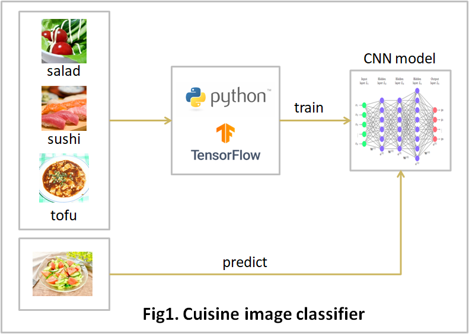

# cuisine-image-classifier

# 1. What you can do

* To create an image-classifier model, and predict images by the model.

 

 

# 2. How to use

* Install the prerequisite python libraries

* Activate Jupyter notebook
  * $ jupyter notebook

 

* Setup dataset
  * Execute Jupyter notebook : **setup_dataset.ipynb** 

* Create a model
  * Execute Jupyter notebook : **_1_train.ipynb** 

 

* Predict image(s)
  * Execute Jupyter notebook : **_2_predict.ipynb**

 

# 3. System
* OS: Windows 10/11, Ubuntu 20.04.6 LTS 
* Python 3.13.7 
* Python Libraries: See the requirements.txt file

 

# 4. Directories and Files

| Directory/File |D/F| description |
| :------------- | :-| :---------- |
| dataset | Dir | image files|
| dataset/images.zip | File | a compressed file of 810 photo images |
| model | Dir | Machine learning model |
| model/best_model_2.18.0.keras | File | trained model |
| output | Dir | working directory |
| _1_train.ipynb | File | create a model |
| _2_predict.ipyno | File | prediect image(s) |
| README.md | File ||
| requirements.txt | File | prerequisite libraries |
| setup_dataset.ipynb | File | unzip images.zip and prepare input data |

## contents of images.zip

| Directory | Cusine | number of images |
| :-------- | :------| :--------------- |
| test/salad | サラダ | 70 |
| test/sushi | すし | 70 |
| test/tofu | 麻婆豆腐 | 70 |
| train/salad | サラダ | 200 |
| train/sushi | すし | 200 |
| train/tofu | 麻婆豆腐 | 200 |
||Total | 810 |
